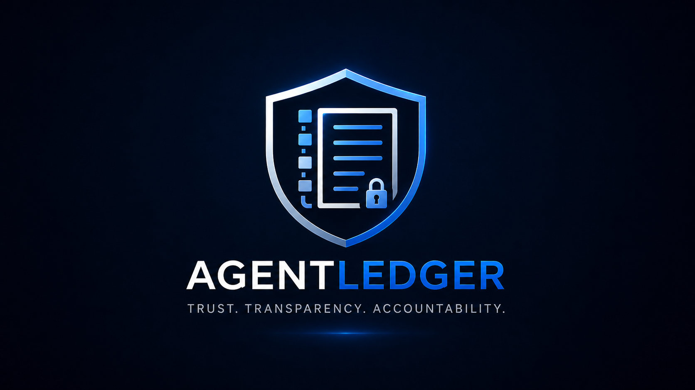
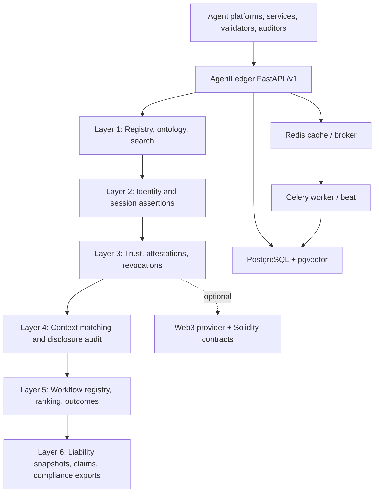

# AgentLedger

<p align="center">
  
</p>

AgentLedger is local proof-of-concept infrastructure for discovery, identity, trust, context disclosure, workflow validation, and liability evidence in the autonomous agent web.

## Purpose

This project demonstrates a six-layer trust infrastructure for agent-native services. It solves the problem of discovering, validating, ranking, auditing, and attributing responsibility for agent-service interactions by combining a manifest registry, identity/session assertions, trust scoring, context disclosure controls, workflow validation, and liability evidence capture.

AgentLedger is infrastructure, not an orchestration runtime. Agent platforms execute workflows; AgentLedger registers services, verifies identities, computes trust signals, controls context disclosure, publishes validated workflow specifications, and preserves evidence for dispute and regulatory workflows.

## Intended Audience

This project is intended for:

- AI agent infrastructure builders.
- API/platform engineers evaluating service discovery and trust patterns.
- Researchers reviewing agent trust, context disclosure, workflow quality, and liability evidence architectures.
- Technical reviewers assessing a runnable proof of concept.

Expected background:

- Python/FastAPI basics.
- Docker Compose.
- REST API testing with curl or the OpenAPI UI.
- PostgreSQL/Redis basics for deeper debugging.
- Solidity/Hardhat only if working on Layer 3 contracts.

This project is not intended for production processing of real user data without additional security, privacy, legal, and operational review.

## Project Status

Current status: v0.1.0 local proof of concept.

Layers 1-6 are implemented and tested locally.

| Layer | Capability | v0.1.0 Status |
|---|---|---|
| Layer 1 | Manifest registry, ontology discovery, structured search, semantic search | Implemented |
| Layer 2 | Agent identity, verifiable credentials, session assertions, HITL approval | Implemented |
| Layer 3 | Auditor network, attestations, revocations, audit chain, trust scoring | Code-complete; testnet deployment deferred |
| Layer 4 | Context profiles, mismatch detection, matching, selective disclosure, compliance PDF export | Implemented |
| Layer 5 | Workflow registry, validation queue, ranking, context bundles, execution outcome quality loop | Implemented |
| Layer 6 | Liability snapshots, dispute claims, evidence gathering, attribution, regulatory exports | Implemented |

Latest local validation in this workspace:

```bash
PYTEST_DISABLE_PLUGIN_AUTOLOAD=1 pytest -p pytest_asyncio tests -q
# 346 passed
```

Do not treat v0.1.0 as production-ready.

## Key Features

- Service manifest registration with ontology validation.
- Structured and semantic service discovery.
- DID-based agent and service identity flows.
- Trust scoring, attestations, revocations, and chain-status integration.
- Agent-owned context profiles and disclosure audit trails.
- HMAC-SHA256 commitments for sensitive context disclosure in v0.1.0.
- Human validation queue for workflow definitions.
- Workflow ranking and context bundle approval flows.
- Synchronous liability snapshots at workflow execution reporting time.
- Evidence gathering and attribution for liability claims.
- Context and liability compliance PDF export paths.

## Repository Structure

```text
.
|-- api/                    FastAPI app, routers, models, services
|-- contracts/              Solidity contracts and Hardhat scripts
|-- crawler/                Celery worker tasks
|-- db/                     Alembic migrations and seed scripts
|-- docs/                   Reviewer docs, architecture notes, lessons
|-- examples/               Sample API inputs and representative outputs
|-- ontology/               Capability ontology source
|-- spec/                   Layer specs, release notes, completion docs
|-- tests/                  API, crawler, integration, and load tests
|-- docker-compose.yml      Local POC stack
|-- Dockerfile              App image
|-- requirements.txt        Python dependencies
|-- package.json            Layer 3 contract tooling
```

## Requirements

| Requirement | Version / Notes |
|---|---|
| Docker + Docker Compose | Required for the recommended local stack. |
| Python | 3.11+ in Docker image; host-side tests in this workspace used Python 3.12. |
| PostgreSQL | Provided by Docker Compose as `pgvector/pgvector:pg15`. |
| Redis | Provided by Docker Compose as `redis:7-alpine`. |
| Node.js/npm | Required only for Solidity contract work. Version: TODO. |
| GPU | Not required for local POC mode. |
| External services | Not required for local POC mode. Layer 3 testnet writes require RPC, deployed contracts, signer key, and testnet funds. |

See [docs/INSTALLATION.md](docs/INSTALLATION.md) and [.env.example](.env.example).

## Quickstart

```bash
git clone https://github.com/mwill20/AgentLedger.git
cd AgentLedger
cp .env.example .env
docker compose up -d --build
```

Windows PowerShell:

```powershell
git clone https://github.com/mwill20/AgentLedger.git
cd AgentLedger
Copy-Item .env.example .env
docker compose up -d --build
```

Verify:

```bash
curl http://localhost:8000/v1/health
curl -H "X-API-Key: dev-local-only" http://localhost:8000/v1/ontology
```

Expected success signals:

```text
GET /v1/health returns status "ok".
GET /v1/ontology returns ontology_version "0.1" and total_tags 65.
OpenAPI docs render at http://localhost:8000/docs.
```

Default local keys unless overridden:

- API key: `dev-local-only`
- Admin API key: `dev-local-admin`

For full Layer 2 credential issuance, configure `ISSUER_PRIVATE_JWK` in `.env`.

## Usage

Open the API docs:

```text
http://localhost:8000/docs
```

Register the sample service manifest:

```bash
curl -X POST http://localhost:8000/v1/manifests \
  -H "Content-Type: application/json" \
  -H "X-API-Key: dev-local-only" \
  --data @examples/service_manifest.sample.json
```

Search services:

```bash
curl -X POST http://localhost:8000/v1/search \
  -H "Content-Type: application/json" \
  -H "X-API-Key: dev-local-only" \
  -d '{"query":"book a flight","limit":5}'
```

See [docs/USAGE.md](docs/USAGE.md) for more local smoke paths.

## Example Input And Output

Sample manifest input:

- [examples/service_manifest.sample.json](examples/service_manifest.sample.json)

Representative manifest registration response shape:

- [examples/service_manifest_response.sample.json](examples/service_manifest_response.sample.json)

Actual response values depend on the current database state, manifest content, and configured environment.

## Architecture



For the full architecture design, including runtime topology, layer responsibilities, data stores, key flows, trust boundaries, and non-goals, see [docs/ARCHITECTURE.md](docs/ARCHITECTURE.md).

## Evaluation

See [docs/EVALUATION.md](docs/EVALUATION.md).

Current recorded local validation:

| Check | Result | Notes |
|---|---|---|
| Full test suite | 346 passed | Observed in this workspace before this documentation update. |
| Health endpoint | HTTP 200 | Local Docker stack. |
| OpenAPI docs | HTTP 200 | Local Docker stack. |
| Ontology endpoint | HTTP 200, 65 tags | Requires `X-API-Key`. |

Performance/resource characteristics that are not in the repo are marked `Not yet measured` in the evaluation and monitoring docs.

## Data And Model Notes

- This repository does not include a machine-learning training dataset.
- It uses a repository-local ontology file at [ontology/v0.1.json](ontology/v0.1.json).
- It does not train or fine-tune a model.
- Semantic search can use deterministic hash embeddings locally or sentence-transformers when configured.

See [docs/DATASET.md](docs/DATASET.md) and [docs/MODEL_CARD.md](docs/MODEL_CARD.md).

## Security Considerations

See [SECURITY.md](SECURITY.md).

Important local cautions:

- Do not commit `.env`, API keys, private JWKs, blockchain signer keys, database dumps, or real user data.
- POC Redis failure behavior is fail open.
- Compliance exports are evidence packages, not legal certifications.
- Liability attribution outputs are evidence-backed computation outputs, not binding legal rulings.

## Limitations

See [docs/LIMITATIONS.md](docs/LIMITATIONS.md).

Key limitations:

- Local-only POC deployment target.
- Layer 3 testnet deployment deferred.
- No root license file yet.
- Legal/security reviews deferred for POC.
- Production monitoring, backups, hosted deployment, and resource benchmarks are TODO.

## Deployment

See [docs/DEPLOYMENT.md](docs/DEPLOYMENT.md).

Current deployment target: local Docker Compose only.

## Monitoring And Maintenance

See [docs/MONITORING.md](docs/MONITORING.md) and [docs/TROUBLESHOOTING.md](docs/TROUBLESHOOTING.md).

## API Surface

The complete interactive API reference is available at:

```text
http://localhost:8000/docs
```

Canonical implementation specs:

- [Layer 1 spec](spec/LAYER1_SPEC.md)
- [Layer 2 spec](spec/LAYER2_SPEC.md)
- [Layer 3 spec](spec/LAYER3_SPEC.md)
- [Layer 4 spec](spec/LAYER4_SPEC.md)
- [Layer 5 spec](spec/LAYER5_SPEC.md)
- [Layer 6 spec](spec/LAYER6_SPEC.md)

Completion and release docs:

- [Layer 1 completion](spec/LAYER1_COMPLETION.md)
- [Layer 2 completion](spec/LAYER2_COMPLETION.md)
- [Layer 3 completion](spec/LAYER3_COMPLETION.md)
- [Layer 5 completion](spec/LAYER5_COMPLETION.md)
- [Layer 6 completion](spec/LAYER6_COMPLETION.md)
- [v0.1.0 release notes](spec/RELEASE_NOTES_v0.1.0.md)
- [operations runbook](spec/OPERATIONS_RUNBOOK.md)
- [environment matrix](spec/ENV_MATRIX.md)
- [legal scope note](spec/LEGAL_SCOPE_NOTE.md)

TODO: Add or link a Layer 4 completion summary if one is intended to be part of the release docs.

## Access And Availability

| Item | Status |
|---|---|
| Repository | `https://github.com/mwill20/AgentLedger.git` |
| Project status | Local proof of concept. |
| Open source status | TODO: depends on selected license. |
| Dataset access | Not applicable; no training dataset is included. |
| Model access | Optional sentence-transformers model path; see [docs/MODEL_CARD.md](docs/MODEL_CARD.md). |
| External service access | Not required for local POC; required for live Layer 3 testnet writes. |

## License

TODO: Add a root `LICENSE` file. Until a license is added, usage rights are unclear.

## Support

For questions, bugs, or feature requests, open a GitHub issue.

Security issues should follow [SECURITY.md](SECURITY.md). TODO: add a private security contact.
