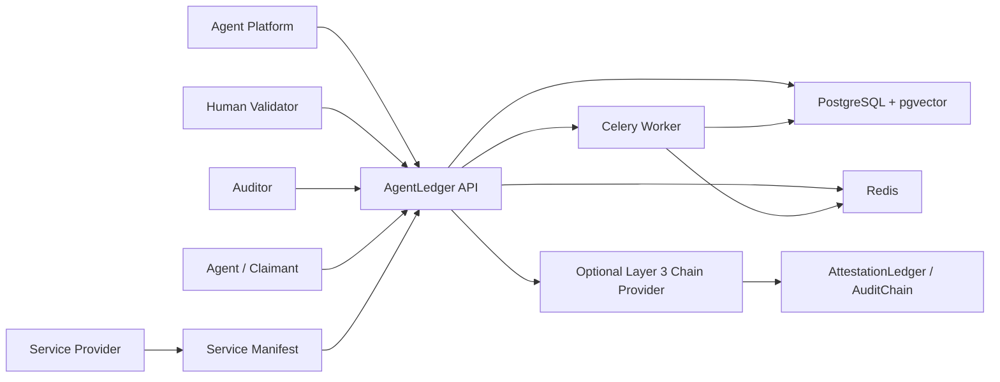
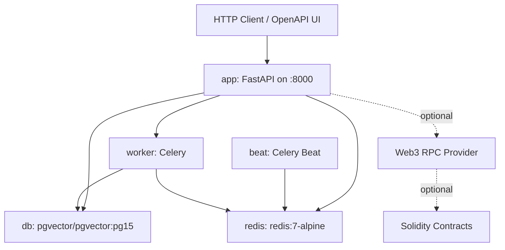
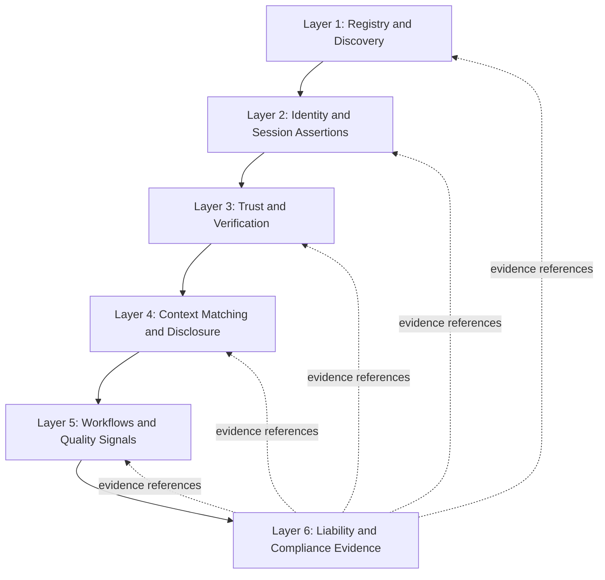
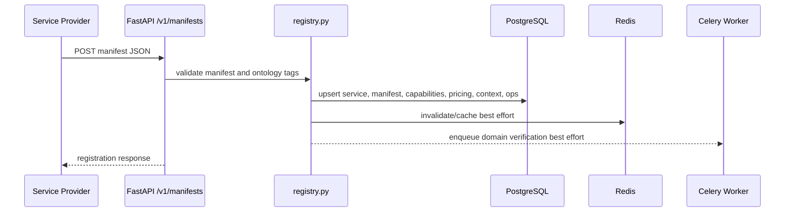
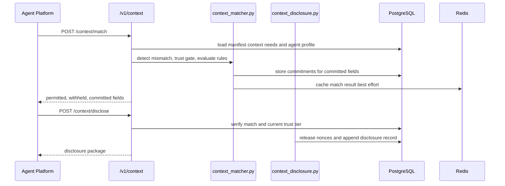
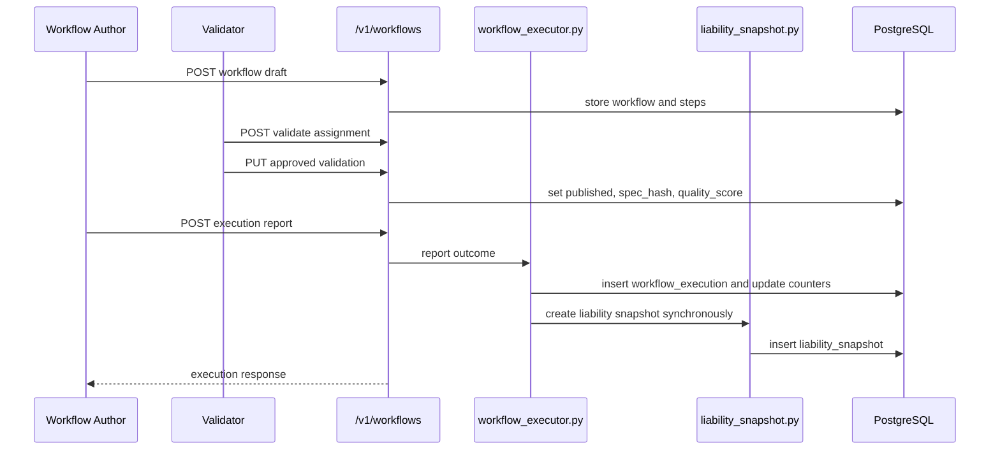
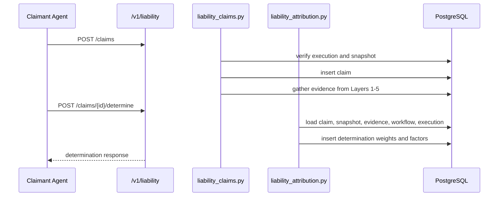

# AgentLedger Architecture Design

## Scope

This document describes the implemented AgentLedger v0.1.0 architecture as a local proof of concept. It is based on the current repository structure, FastAPI routers, Docker Compose topology, Alembic migrations, and layer specifications.

AgentLedger is infrastructure for the autonomous agent web. It is not an agent runtime and does not execute workflows. Agent platforms execute workflows; AgentLedger registers services, verifies identities, computes trust signals, controls context disclosure, publishes validated workflow specifications, and records evidence for liability and compliance workflows.

## System Context

## Runtime Deployment Topology

The documented v0.1.0 deployment target is local Docker Compose.

| Component | Implementation | Responsibility |
|---|---|---|
| API app | `api/main.py`, `api/routers/*` | FastAPI service, request validation, route orchestration. |
| Service layer | `api/services/*` | Business logic for registry, identity, trust, context, workflows, liability. |
| PostgreSQL | `pgvector/pgvector:pg15` | Durable source of truth for all layers. |
| pgvector | PostgreSQL extension | Capability embedding storage and similarity search. |
| Redis | `redis:7-alpine` | Cache, rate-limit support, Celery broker/result backend behavior. |
| Worker | `crawler.worker:celery_app` | Background crawler/domain verification tasks. |
| Beat | `crawler.worker:celery_app beat` | Scheduled worker task trigger. |
| Contracts | `contracts/*.sol` | Layer 3 AttestationLedger and AuditChain contract code. |
| Migrations | `db/migrations/versions/*.py` | Schema evolution through migration head `007`. |

## API Boundary

All application routers are mounted under `/v1`.

| Router | Main Responsibility |
|---|---|
| `health.py` | Health endpoint. |
| `ontology.py` | Capability ontology read API. |
| `manifests.py` | Service manifest registration. |
| `services.py` | Structured service lookup and service detail. |
| `search.py` | Semantic service search. |
| `verify.py` | Service domain verification trigger. |
| `identity.py` | Agent identity, session, credential, and approval flows. |
| `attestation.py` | Auditor and attestation APIs. |
| `audit.py` | Audit records and audit chain APIs. |
| `federation.py` | Federation blocklist and revocation APIs. |
| `chain.py` | Chain status and event APIs. |
| `context.py` | Context profiles, matching, disclosure, mismatch, and context compliance APIs. |
| `workflows.py` | Workflow registry, validation, ranking, context bundles, and execution reports. |
| `liability.py` | Liability snapshots, claims, attribution, and compliance export APIs. |

## Layered Architecture

### Layer 1: Registry And Discovery

Purpose: ingest and query service manifests.

Implemented by:

- Routers: `manifests.py`, `services.py`, `search.py`, `ontology.py`, `verify.py`
- Services: `registry.py`, `embedder.py`, `ranker.py`, `typosquat.py`, `verifier.py`
- Tables: `ontology_tags`, `services`, `manifests`, `service_capabilities`, `service_pricing`, `service_context_requirements`, `service_operations`, `crawl_events`, `api_keys`

Key behavior:

- Validates service manifest payloads and ontology tags.
- Stores current manifests and service capability rows.
- Supports structured query by ontology tag and semantic search with embeddings.
- Uses `EMBEDDING_MODE=hash` for deterministic local mode and `EMBEDDING_MODE=model` for sentence-transformers mode when configured.
- Queues domain verification when Celery/Redis is available; enqueue is best-effort in local POC mode.

### Layer 2: Identity And Session Assertions

Purpose: represent agents and service identities using DID-oriented flows.

Implemented by:

- Router: `identity.py`
- Services: `identity.py`, `sessions.py`, `service_identity.py`, `credentials.py`, `crypto.py`, `did.py`, `authorization.py`
- Tables: `agent_identities`, `revocation_events`, `authorization_requests`, `session_assertions`

Key behavior:

- Registers and verifies agent identities.
- Issues and redeems session assertions when issuer key material is configured.
- Supports human approval flows for sensitive sessions.
- Full issuance requires `ISSUER_PRIVATE_JWK`.

### Layer 3: Trust And Verification

Purpose: record auditor attestations, revocations, audit records, federation state, and optional chain status/events.

Implemented by:

- Routers: `attestation.py`, `audit.py`, `federation.py`, `chain.py`
- Services: `trust.py`, `auditor.py`, `audit.py`, `federation.py`, `chain.py`, `merkle.py`
- Tables: `auditors`, `attestation_records`, `audit_records`, `audit_batches`, `federated_registries`, `chain_events`
- Contracts: `contracts/AttestationLedger.sol`, `contracts/AuditChain.sol`

Key behavior:

- Registers auditors and records attestations.
- Tracks audit records and audit batches.
- Provides chain status and event views.
- Contract code is present, but v0.1.0 testnet deployment is deferred.

### Layer 4: Context Matching And Disclosure

Purpose: decide which context fields may be shared, withheld, or committed, and maintain a privacy-preserving audit trail.

Implemented by:

- Router: `context.py`
- Services: `context_profiles.py`, `context_mismatch.py`, `context_matcher.py`, `context_disclosure.py`, `context_compliance.py`
- Tables: `context_profiles`, `context_profile_rules`, `context_commitments`, `context_disclosures`, `context_mismatch_events`

Key behavior:

- Stores agent context profiles and priority-ordered rules.
- Detects over-requested fields before profile rule evaluation.
- Applies trust-tier gates before disclosure.
- Uses HMAC-SHA256 commitments for committed sensitive fields in v0.1.0.
- Releases nonces only through selective disclosure flow and records append-only disclosure history.
- Supports erasure marking without deleting audit records.

### Layer 5: Workflows And Quality Signals

Purpose: validate and serve workflow specifications, rank service candidates, aggregate context needs, and record execution outcomes.

Implemented by:

- Router: `workflows.py`
- Services: `workflow_registry.py`, `workflow_validator.py`, `workflow_ranker.py`, `workflow_context.py`, `workflow_executor.py`
- Tables: `workflows`, `workflow_steps`, `workflow_validations`, `workflow_executions`, `workflow_scoped_profiles`, `workflow_context_bundles`

Key behavior:

- Stores workflow specs and steps.
- Uses a validation queue before workflow publication.
- Stores spec hashes for published workflow immutability.
- Ranks candidate services by trust and capability constraints.
- Creates workflow context bundles for single-approval UX.
- Records execution outcomes and verifies against Layer 4 disclosure evidence when available.
- Creates Layer 6 snapshots synchronously during execution reporting.

### Layer 6: Liability And Compliance Evidence

Purpose: capture execution-time evidence, support claims, compute attribution, and generate compliance exports.

Implemented by:

- Router: `liability.py`
- Services: `liability_snapshot.py`, `liability_claims.py`, `liability_attribution.py`, `liability_compliance.py`
- Tables: `liability_snapshots`, `liability_claims`, `liability_evidence`, `liability_determinations`, `compliance_exports`

Key behavior:

- Captures liability snapshots synchronously when workflow executions are reported.
- Files claims for workflow executions with existing snapshots.
- Gathers evidence across Layers 1-5 into immutable evidence records.
- Computes attribution weights across agent, service, workflow author, and validator.
- Generates compliance export PDFs for supported export types.

## Persistent Data Model

The schema is migration-driven and grouped by layer.

| Migration | Layer | Primary Tables |
|---|---|---|
| `001_initial_schema.py` | Layer 1 | `ontology_tags`, `services`, `manifests`, `service_capabilities`, `service_pricing`, `service_context_requirements`, `service_operations`, `crawl_events`, `api_keys` |
| `002_layer2_identity.py` | Layer 2 | `agent_identities`, `revocation_events` |
| `003_layer2_sessions.py` | Layer 2 | `authorization_requests`, `session_assertions` |
| `004_layer3_trust_verification.py` | Layer 3 | `auditors`, `attestation_records`, `audit_records`, `audit_batches`, `federated_registries`, `chain_events` |
| `005_layer4_context.py` | Layer 4 | `context_profiles`, `context_profile_rules`, `context_commitments`, `context_disclosures`, `context_mismatch_events` |
| `006_layer5_workflows.py` | Layer 5 | `workflows`, `workflow_steps`, `workflow_validations`, `workflow_executions`, `workflow_scoped_profiles`, `workflow_context_bundles` |
| `007_layer6_liability.py` | Layer 6 | `liability_snapshots`, `liability_claims`, `liability_evidence`, `liability_determinations`, `compliance_exports` |

## Key End-To-End Flows

### Service Registration And Discovery

### Context Match And Selective Disclosure

### Workflow Publication And Execution Evidence

### Claim And Attribution

## Cache And Async Design

| Mechanism | Used For | Source Of Truth | Failure Behavior In POC |
|---|---|---|---|
| Redis query/cache keys | Search, workflow ranking, context match, claim status | PostgreSQL | Best-effort cache miss/fail-open behavior. |
| Redis rate-limit support | IP/API/claim rate controls where implemented | PostgreSQL and request path | POC favors availability; production should revisit fail-closed choices. |
| Celery worker | Domain verification and crawler-style background tasks | PostgreSQL | Enqueue is best effort for local POC. |
| Synchronous writes | Liability snapshot during workflow execution reporting | PostgreSQL | Intentional fail-closed path for evidence integrity. |

## Security And Trust Boundaries

| Boundary | Risk | Implemented Control / Status |
|---|---|---|
| Untrusted manifest JSON | invalid schema, bad ontology tags, null bytes | Pydantic validation, ontology lookup, input sanitization. |
| API clients | unauthorized requests | API-key dependency on protected endpoints; credential flows where implemented. |
| DID/session inputs | replay or forged proof | nonce/TTL checks and signature verification where configured. |
| Context requests | over-requesting sensitive data | mismatch detection before profile evaluation. |
| Sensitive context values | plaintext exposure | HMAC commitments and nonce release flow for committed fields. |
| Workflow publication | approved workflow mutation | spec hash and published workflow immutability checks. |
| Execution evidence | post-event trust mutation | synchronous liability snapshots. |
| Legal/compliance interpretation | overclaiming evidence | docs state exports and attribution are evidence outputs, not legal certification. |

## Non-Goals In v0.1.0

- Agent workflow execution.
- Production-hosted deployment.
- Binding legal determinations.
- Licensed insurance underwriting.
- Payment custody or escrow execution.
- Full ZKP circuit implementation.
- Guaranteed live Layer 3 testnet writes in local quickstart.

## Operational Characteristics

| Area | Current Design |
|---|---|
| Deployment target | Local Docker Compose. |
| App startup | `entrypoint.sh` runs `alembic upgrade head`, `db/seed_ontology.py`, then Uvicorn. |
| API version | `0.1.0` in FastAPI metadata and compose environment. |
| Ontology seed | `db/seed_ontology.py` loads `ontology/v0.1.json`. |
| Migrations | Alembic revisions `001` through `007`. |
| OpenAPI | Served by FastAPI at `/docs`. |
| License | MIT license in the root `LICENSE` file. |
| Production readiness | Not claimed for v0.1.0. |

## Architecture Risks And Follow-Ups

| Risk / Gap | Current Status | Follow-Up |
|---|---|---|
| License obligations | MIT permits broad reuse but keeps notice and warranty disclaimer obligations. | Downstream users should retain the license notice and complete their own legal review. |
| Redis fail-open behavior | Suitable for POC availability. | Reassess for production abuse controls. |
| Layer 3 testnet deployment deferred | Contract code exists but live deployment is not default. | Configure RPC, signer, contracts, and funded testnet wallet. |
| Model-mode semantic search details | `all-MiniLM-L6-v2` referenced; license/version details not documented. | Add authoritative model source and license before publication claims. |
| Production secrets | `.env.example` is safe; `.env` must remain uncommitted. | Use secret manager for production-like deployment. |
| Real user data | Not appropriate for POC without review. | Complete security, privacy, and legal review first. |

## Source Files To Review

| Area | Files |
|---|---|
| App entry point | `api/main.py` |
| Routers | `api/routers/*.py` |
| Services | `api/services/*.py` |
| Models | `api/models/*.py` |
| Migrations | `db/migrations/versions/*.py` |
| Compose topology | `docker-compose.yml` |
| Contracts | `contracts/AttestationLedger.sol`, `contracts/AuditChain.sol` |
| Specs | `spec/LAYER1_SPEC.md` through `spec/LAYER6_SPEC.md` |
| Operations | `spec/OPERATIONS_RUNBOOK.md`, `docs/DEPLOYMENT.md`, `docs/MONITORING.md` |
